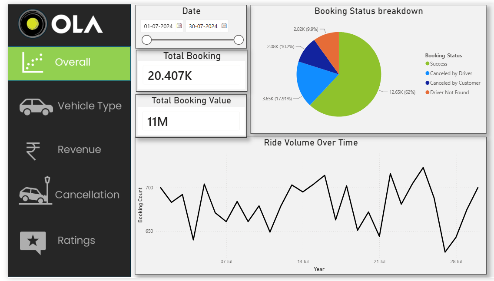
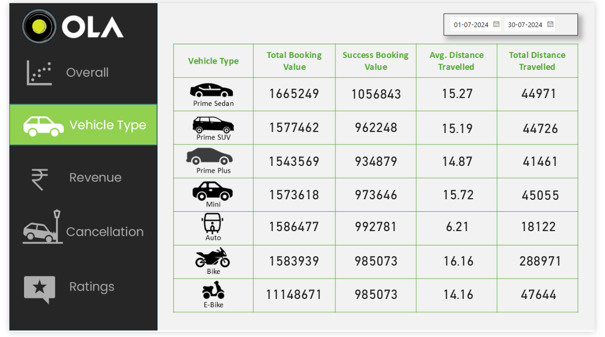
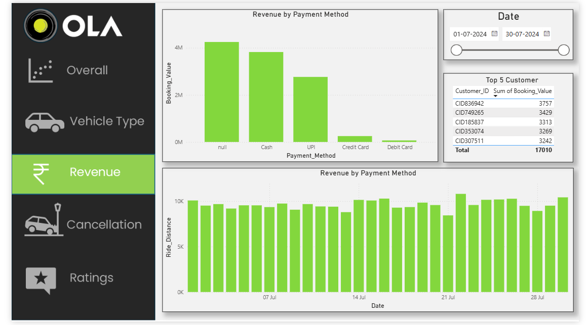
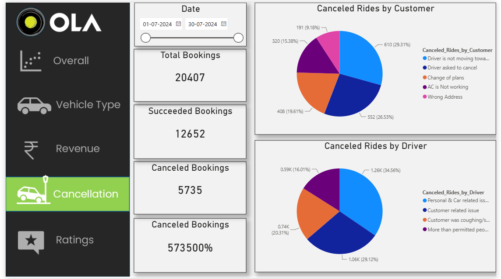
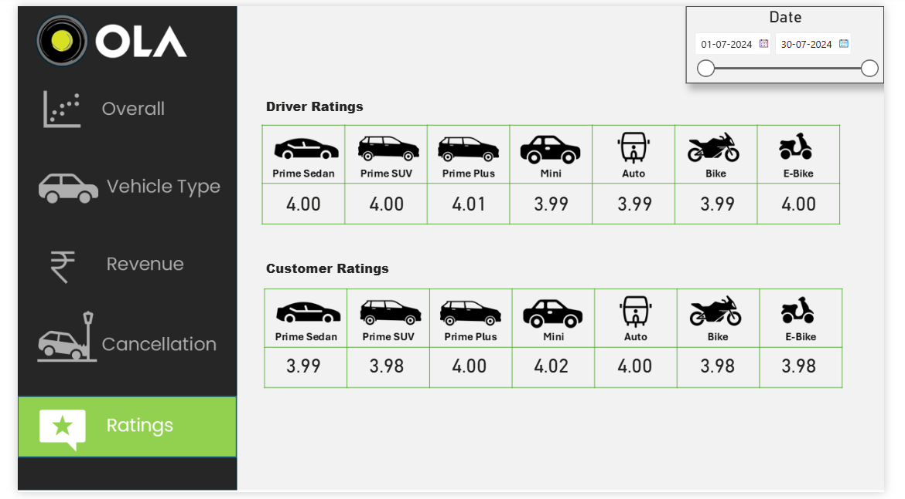

<div align="center">

# 🚕 OLA Data Analytics

### SQL • Power BI • Data Analysis • Business Intelligence

**A practical Data Analytics learning project focused on OLA ride-booking data**

<br>


</div>

---

## 📌 Project Overview

**OLA Data Analytics** is a practical Data Analytics project built around an OLA ride-booking dataset.

The project focuses on understanding ride-booking patterns, booking statuses, vehicle performance, cancellations, revenue, ride distance, and customer/driver ratings using **SQL and Microsoft Power BI**.

This project was created as a **hands-on learning and portfolio project** by following a publicly available tutorial/reference project and implementing the Power BI dashboard based on the given requirements.

---

## 🎯 Project Objectives

The main objectives of this project are to:

* Analyze OLA ride-booking data
* Understand booking status and ride volume
* Compare different vehicle types
* Analyze ride distance and booking value
* Identify customer and driver cancellation patterns
* Analyze payment methods and revenue
* Understand customer and driver ratings
* Practice SQL querying and data aggregation
* Build an interactive Power BI dashboard
* Gain practical experience in Data Analytics and Business Intelligence

---

## 🛠️ Tools & Technologies

| Tool                    | Purpose                                      |
| ----------------------- | -------------------------------------------- |
| **Microsoft Power BI**  | Dashboard development and data visualization |
| **SQL / MySQL**         | Data querying and analysis                   |
| **Excel / CSV Dataset** | Data source and preparation                  |
| **GitHub**              | Project documentation and version control    |

---

# 📊 Dashboard Preview

The Power BI dashboard is organized into different analytical sections covering overall performance, vehicle types, revenue, cancellations, and ratings.

## 1. Overview

The overview section provides a high-level understanding of ride volume and booking status.

<p align="center">
  
</p>

### Analysis covered

* Ride Volume Over Time
* Booking Status Breakdown
* Overall ride-booking performance
* Booking status distribution

---

## 2. Vehicle Type Analysis

This section focuses on the performance of different OLA vehicle categories.

<p align="center">
  
</p>

### Analysis covered

* Top 5 Vehicle Types by Ride Distance
* Average Customer Ratings by Vehicle Type
* Comparison of vehicle categories
* Ride-distance performance

---

## 3. Revenue Analysis

This section analyzes booking value and payment-related information.

<p align="center">
  
</p>

### Analysis covered

* Revenue by Payment Method
* Top 5 Customers by Total Booking Value
* Ride Distance Distribution Per Day
* Booking value analysis

---

## 4. Cancellation Analysis

This section analyzes why rides were cancelled by customers and drivers.

<p align="center">
  
</p>

### Analysis covered

* Customer cancellation reasons
* Driver cancellation reasons
* Cancellation patterns
* Incomplete ride information

---

## 5. Ratings Analysis

This section focuses on customer and driver ratings.

<p align="center">
  
</p>

### Analysis covered

* Driver Rating Distribution
* Customer Rating Distribution
* Customer vs. Driver Ratings
* Rating comparison across vehicle types

---

# 🧮 SQL Analysis

The project includes SQL-based analysis of the OLA booking dataset.

The SQL section contains questions covering filtering, aggregation, grouping, sorting, counting, and basic analytical queries.

### SQL Questions Covered

#### 1. Retrieve all successful bookings

Find all rides where the booking status is `Success`.

#### 2. Average ride distance for each vehicle type

Calculate the average ride distance for every vehicle category.

#### 3. Total cancelled rides by customers

Count the number of rides cancelled by customers.

#### 4. Top 5 customers by number of rides

Identify the five customers with the highest number of bookings.

#### 5. Driver cancellations due to personal and car-related issues

Find the number of rides cancelled by drivers because of personal or car-related issues.

#### 6. Maximum and minimum driver ratings for Prime Sedan

Find the highest and lowest driver ratings for Prime Sedan bookings.

#### 7. Rides paid using UPI

Retrieve bookings where the payment method was UPI.

#### 8. Average customer rating by vehicle type

Calculate the average customer rating for each vehicle category.

#### 9. Total booking value of successful rides

Calculate the total booking value generated by successfully completed rides.

#### 10. Incomplete rides with reasons

List incomplete rides together with the reason for incompletion.

### SQL File

The organized SQL queries are available here:

`SQL/ola_analysis.sql`

---

# 📈 Power BI Analysis

The Power BI dashboard covers the following analytical questions:

| #  | Analysis                                 |
| -- | ---------------------------------------- |
| 1  | Ride Volume Over Time                    |
| 2  | Booking Status Breakdown                 |
| 3  | Top 5 Vehicle Types by Ride Distance     |
| 4  | Average Customer Ratings by Vehicle Type |
| 5  | Cancelled Rides – Customer Reasons       |
| 6  | Cancelled Rides – Driver Reasons         |
| 7  | Revenue by Payment Method                |
| 8  | Top 5 Customers by Total Booking Value   |
| 9  | Ride Distance Distribution Per Day       |
| 10 | Driver and Customer Ratings Analysis     |

---

# 🗂️ Dashboard Sections

The dashboard is organized into five major analytical areas:

### 🚕 Overall

* Ride Volume Over Time
* Booking Status Breakdown

### 🚗 Vehicle Type

* Top Vehicle Types by Ride Distance
* Average Customer Ratings

### 💰 Revenue

* Revenue by Payment Method
* Top Customers by Booking Value
* Ride Distance Distribution

### ❌ Cancellation

* Customer Cancellation Reasons
* Driver Cancellation Reasons
* Incomplete Rides

### ⭐ Ratings

* Driver Ratings
* Customer Ratings
* Customer vs. Driver Ratings

---

# 📂 Dataset

The project uses an OLA ride-booking dataset containing information related to:

* Date
* Time
* Booking ID
* Booking Status
* Customer ID
* Vehicle Type
* Pickup Location
* Drop Location
* Vehicle Arrival Time (V_TAT)
* Customer Arrival Time (C_TAT)
* Customer Cancellations
* Driver Cancellations
* Incomplete Rides
* Incomplete Ride Reasons
* Booking Value
* Payment Method
* Ride Distance
* Driver Ratings
* Customer Ratings

The dataset is used for educational and analytical purposes.

---

# 📁 Repository Structure

```text
OLA-Data-Analytics/
│
├── README.md
│
├── PowerBI/
│   ├── OLA_Data_Analytics.pbix
│   └── README.md
│
├── SQL/
│   └── ola_analysis.sql
│
├── Screenshots/
│   ├── README.md
│   ├── overview.png
│   ├── vehicle-type.png
│   ├── revenue.png
│   ├── cancellation.png
│   └── ratings.png
│
└── Documentation/
    ├── README.md
    └── Project Documentation
```

---

# 📦 Project Files

### Power BI Dashboard

The complete Power BI `.pbix` file is available in:

`PowerBI/OLA_Data_Analytics.pbix`

You can open this file using **Microsoft Power BI Desktop**.

### SQL Analysis

The SQL analysis is available in:

`SQL/ola_analysis.sql`

### Documentation

Supporting learning material, project questions, and reference information are available in:

`Documentation/`

### Dashboard Screenshots

Dashboard screenshots are available in:

`Screenshots/`

---

# 💡 Skills Practiced

Through this project, I practiced:

* Data Analysis
* SQL
* Data Aggregation
* Filtering and Grouping
* Business Questions to Data Queries
* Power BI
* Data Visualization
* Dashboard Design
* KPI-oriented analysis
* Ride and Revenue Analysis
* Cancellation Analysis
* Customer and Driver Rating Analysis
* GitHub Project Organization
* Technical Documentation

---

# 📚 Learning Reference & Attribution

### ⚠️ Transparency Note

This project was created as a **learning project by following a publicly available YouTube tutorial/project**.

The original project questions, SQL questions/answers, Power BI requirements, and related reference documentation were provided as part of the learning material.

**The original tutorial/reference documentation is not my original work.**

My contribution to this repository is primarily the **Power BI implementation and dashboard creation**, where I followed the project requirements and built the Power BI dashboard for learning and practical experience.

The SQL and documentation files are included as **reference/learning material** and are organized in this repository for project documentation purposes.

All original tutorial content and materials belong to their respective creator(s).

---

# 🚀 What I Learned

This project helped me understand how a real-world style Data Analytics workflow can be structured:

```text
Dataset
   ↓
Business Questions
   ↓
SQL Analysis
   ↓
Data Understanding
   ↓
Power BI Visualization
   ↓
Dashboard
   ↓
Business Insights
```

It also helped me practice converting analytical questions into queries and visualizations.

---

# 🔮 Future Improvements

Possible future improvements for this project include:

* Adding more advanced SQL analysis
* Adding additional KPIs
* Improving dashboard interactivity
* Adding drill-through pages
* Adding more detailed business insights
* Performing deeper customer segmentation
* Adding time-based trend analysis
* Connecting Power BI directly to a database
* Automating data refresh
* Adding advanced DAX measures

---

# 👨‍💻 Author

### Harsh Shigvan

**B.E. Computer Science & Engineering (AI & ML)**
Gharda Institute of Technology

Interested in:

**Data Analytics • Power BI • SQL • Python • Full-Stack Development • AI & ML**

---

<div align="center">

### 🚕 OLA Data Analytics

**Learn → Analyze → Visualize → Build**

⭐ If you found this project useful, feel free to explore the repository.

</div>
